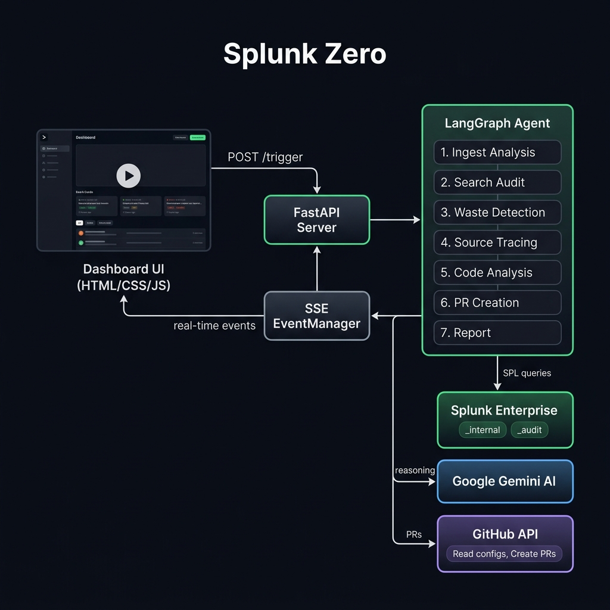

<p align="center">
  
</p>

<h1 align="center">Splunk Zero</h1>
<p align="center">
  <strong>Zero noise. Zero waste. Zero unused data.</strong><br>
  An autonomous AI agent that detects wasteful Splunk ingest, proves low usage<br>
  with Splunk's own data, and opens GitHub pull requests to reduce logging noise.
</p>

<p align="center">
  <a href="#quick-start">Quick Start</a> •
  <a href="#how-it-works">How It Works</a> •
  <a href="#architecture">Architecture</a> •
  <a href="#technology">Technology</a> •
  <a href="#configuration">Configuration</a> •
  <a href="#license">License</a>
</p>

---

## The Problem

Every organization running Splunk at scale pays to ingest logs that nobody reads. Debug-level application logs, verbose service traces, and noisy internal metrics accumulate in indexes — consuming license capacity and storage — while teams only search a fraction of them. The cost adds up silently.

## The Solution

**Splunk Zero** is not a chatbot. It is an autonomous agent that:

1. **Queries** `_internal` to measure ingest volume by sourcetype
2. **Audits** `_audit` to find which sourcetypes teams actually search
3. **Detects** the gap — high-volume sources with zero or low search activity
4. **Traces** wasteful sourcetypes back to GitHub repository logging configs
5. **Analyzes** the code and proposes a safer log level (DEBUG → ERROR)
6. **Creates** a real GitHub pull request with the fix and cost savings evidence
7. **Reports** total monthly and annual savings with PR links

The entire investigation runs autonomously from a single button click. Judges and users watch every step through a live "UI of Thinking" dashboard.

## Quick Start

### Prerequisites

- **Python 3.11+**
- **Splunk Enterprise** (local) with admin access
- **GitHub** personal access token with repo scope
- **Google AI Studio** API key (Gemini)

### Setup

```bash
# Clone the repository
git clone https://github.com/yoriichi-07/splunk-zero.git
cd splunk-zero

# Create virtual environment
python -m venv venv
# Windows
venv\Scripts\activate
# macOS/Linux
source venv/bin/activate

# Install dependencies
pip install -r requirements.txt

# Configure environment
cp .env.example .env
# Edit .env with your Splunk, GitHub, and Gemini credentials
```

### Load Demo Data

```bash
# Load synthetic application debug sourcetypes into Splunk HEC
python -m scripts.synthetic_data
```

### Run

```bash
# Reset the demo repository (cleans branches & PRs)
python -m scripts.reset_demo

# Start the server
python -m src.server
```

Open **http://localhost:8888** and click **Start Investigation**.

## How It Works

Splunk Zero uses a **7-node LangGraph pipeline** that executes autonomously:

| Step | Node | What It Does |
|------|------|-------------|
| 1 | **Ingest Analysis** | Queries `_internal` for ingest volume by sourcetype (GB/day) |
| 2 | **Search Audit** | Queries `_audit` for completed searches by sourcetype |
| 3 | **Waste Detection** | Cross-references ingest vs. search usage to find waste |
| 4 | **Source Tracing** | Maps wasteful sourcetypes to GitHub repos and config files |
| 5 | **Code Analysis** | Reads logging configs, proposes log-level reductions via Gemini |
| 6 | **PR Creation** | Creates branch, commits change, opens PR with cost evidence |
| 7 | **Report** | Summarizes findings, savings, and PR links |

If no waste is detected at step 3, the pipeline skips to step 7 and reports a clean environment.

### Core SPL Queries

**Ingest volume** — what you pay for:
```spl
index=_internal source=*metrics.log group=per_sourcetype_thruput
| stats sum(kb) as total_kb by series
| eval daily_gb = round(total_kb / 1024 / 1024 / 30, 2)
| sort - daily_gb | head 50
| eventstats sum(daily_gb) as grand_total
| eval pct_of_total = round(daily_gb / grand_total * 100, 1)
| table series, daily_gb, pct_of_total
| rename series as sourcetype
```

**Search activity** — what teams actually use:
```spl
index=_audit action=search info=completed
| rex field=search "sourcetype\s*=\s*\"?(?<searched_sourcetype>[^\s\"|]+)"
| stats count as search_count by searched_sourcetype
| sort - search_count
```

## Architecture

```
┌─────────────────┐     POST /trigger      ┌──────────────────┐
│                 │ ──────────────────────> │                  │
│   Dashboard UI  │                        │  FastAPI Server   │
│  (HTML/CSS/JS)  │ <────────────────────  │  (Port 8888)     │
│                 │    SSE Event Stream     │                  │
└─────────────────┘                        └────────┬─────────┘
                                                    │
                                           ┌────────▼─────────┐
                                           │  LangGraph Agent  │
                                           │  (7-node pipeline)│
                                           └──┬─────┬─────┬───┘
                                              │     │     │
                               ┌──────────────┘     │     └──────────────┐
                               ▼                    ▼                    ▼
                    ┌──────────────────┐  ┌─────────────────┐  ┌─────────────────┐
                    │ Splunk Enterprise│  │  Google Gemini   │  │   GitHub API    │
                    │  _internal       │  │  (AI reasoning)  │  │  (PR creation)  │
                    │  _audit          │  │                  │  │                 │
                    └──────────────────┘  └─────────────────┘  └─────────────────┘
```

A visual architecture diagram is included at the root of this repository: [`architecture.png`](architecture.png)

### Data Flow

1. The **Dashboard** sends `POST /trigger` to the FastAPI server
2. The server creates a run ID and starts the **LangGraph pipeline** in the background
3. Each pipeline node:
   - Queries **Splunk** for operational evidence (`_internal`, `_audit`)
   - Uses **Gemini** for source-to-repo mapping and config change reasoning
   - Calls **GitHub** to create branches, commit changes, and open PRs
   - Emits structured events to the **SSE EventManager**
4. The Dashboard subscribes to `GET /events/{run_id}` and renders every step live
5. The final report shows savings and clickable PR links

### Key Endpoints

| Method | Path | Description |
|--------|------|-------------|
| `GET` | `/` | Dashboard UI |
| `GET` | `/health` | System health check (Splunk connectivity) |
| `POST` | `/trigger` | Start an agent pipeline run |
| `GET` | `/events/{run_id}` | SSE stream of pipeline events |
| `POST` | `/reset-demo` | Reset demo repository to clean state |

## Technology

| Layer | Technology |
|-------|-----------|
| **Agent Orchestration** | [LangGraph](https://github.com/langchain-ai/langgraph) (state machine with 7 nodes) |
| **Web Server** | [FastAPI](https://fastapi.tiangolo.com/) + [Uvicorn](https://www.uvicorn.org/) |
| **Splunk Access** | MCP-aware client with REST API fallback |
| **AI Reasoning** | [Google Gemini](https://ai.google.dev/) via LangChain |
| **GitHub Integration** | [PyGithub](https://pygithub.readthedocs.io/) |
| **Real-time Streaming** | Server-Sent Events (SSE) |
| **Frontend** | Vanilla HTML / CSS / JavaScript (no build step) |

### Why This Stack

- **LangGraph** gives us a typed state machine with conditional routing — the pipeline can skip remediation if no waste is found
- **FastAPI + SSE** enables real-time "UI of Thinking" without WebSocket complexity
- **Vanilla frontend** means zero build tooling and instant deployment
- **REST fallback** for Splunk ensures reliability when MCP SSE transport is unstable on Windows

## Project Structure

```
splunk-zero/
├── src/
│   ├── server.py              # FastAPI application
│   ├── config.py              # Environment configuration
│   ├── agent/
│   │   ├── graph.py           # LangGraph workflow definition
│   │   ├── state.py           # Agent state schema
│   │   └── nodes/
│   │       ├── ingest_analysis.py
│   │       ├── search_audit.py
│   │       ├── waste_detection.py
│   │       ├── source_tracing.py
│   │       ├── code_analysis.py
│   │       ├── pr_creation.py
│   │       └── report.py
│   ├── mcp/
│   │   └── splunk_client.py   # Splunk MCP/REST client
│   ├── github/
│   │   └── client.py          # GitHub API wrapper
│   └── ui/
│       ├── events.py          # SSE event manager
│       └── static/
│           ├── index.html     # Dashboard markup
│           ├── style.css      # Design system
│           └── app.js         # SSE handling & rendering
├── scripts/
│   ├── reset_demo.py          # Reset demo repo for clean runs
│   └── synthetic_data.py      # Load demo sourcetypes into Splunk
├── tests/
│   ├── test_pipeline.py       # End-to-end pipeline test
│   ├── test_mcp_connection.py # Splunk connectivity test
│   ├── test_github_connection.py
│   ├── test_llm_connection.py
│   └── test_waste_detection.py # Unit tests for core logic
├── memory/                    # Context engineering (agent handoff docs)
├── planning/                  # Architecture decisions & milestones
├── .env.example               # Environment variable template
├── requirements.txt           # Python dependencies
├── architecture.png           # Visual architecture diagram
├── LICENSE                    # MIT License
└── README.md                  # This file
```

## Configuration

Copy `.env.example` to `.env` and fill in your credentials:

| Variable | Description | Required |
|----------|-------------|----------|
| `SPLUNK_HOST` | Splunk management host | Yes |
| `SPLUNK_PORT` | Splunk management port (default: 8089) | Yes |
| `SPLUNK_TOKEN` | Splunk MCP encrypted token | Yes |
| `SPLUNK_USERNAME` | Splunk admin username | Yes |
| `SPLUNK_PASSWORD` | Splunk admin password | Yes |
| `GITHUB_TOKEN` | GitHub personal access token (repo scope) | Yes |
| `GITHUB_REPO` | Target demo repo (e.g., `user/splunk-zero-demo-app`) | Yes |
| `GOOGLE_API_KEY` | Google AI Studio API key | Yes |
| `LLM_MODEL` | Gemini model name (default: `gemini-3.1-flash-lite`) | No |
| `APP_PORT` | Application port (default: `8888`) | No |
| `COST_PER_GB_PER_DAY` | Splunk license cost per GB/day (default: `15`) | No |
| `WASTE_THRESHOLD_PCT` | Minimum ingest % to flag as waste (default: `5`) | No |
| `MIN_SEARCH_COUNT` | Search count below which a source is "unused" (default: `2`) | No |
| `ANALYSIS_PERIOD_DAYS` | Lookback window in days (default: `30`) | No |
| `SPLUNK_HEC_TOKEN` | HEC token for loading demo data | For demo |
| `SPLUNK_HEC_PORT` | HEC port (default: `8088`) | For demo |

## Demo Setup

The project includes a demo repository (`yoriichi-07/splunk-zero-demo-app`) with a `logging.conf` file. The agent will detect its synthetic debug sourcetypes as waste and create real PRs against it.

```bash
# 1. Load synthetic data into Splunk
python -m scripts.synthetic_data

# 2. Reset demo repo (clean branches, close old PRs, reset logging.conf)
python -m scripts.reset_demo

# 3. Start the server
python -m src.server

# 4. Open http://localhost:8888 and click Start Investigation
```

## Testing

```bash
# Connection tests (requires Splunk running)
python -m tests.test_mcp_connection
python -m tests.test_github_connection
python -m tests.test_llm_connection

# End-to-end pipeline test (requires server running)
python -m tests.test_pipeline

# Unit tests (no external services needed)
python -m pytest tests/test_waste_detection.py -v
```

## Hackathon Track

**Primary:** Platform & Developer Experience  
**Bonus:** Best Use of Splunk MCP Server

Splunk Zero uses Splunk's operational metadata (`_internal` for ingest metrics, `_audit` for search activity) as its evidence source. It combines these data points to make autonomous decisions about log waste, then closes the loop by creating reviewable GitHub pull requests.

## License

This project is licensed under the MIT License — see the [LICENSE](LICENSE) file for details.

---

<p align="center">
  <em>Splunk Zero: Turning operational data into action.</em>
</p>
