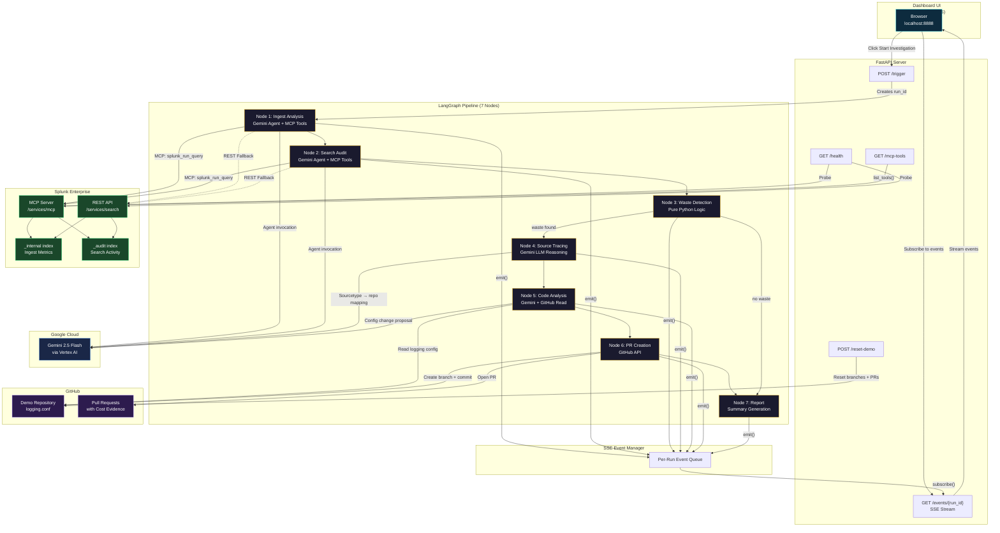

# Splunk Zero — Architecture Diagram

## System Overview

The following diagram shows how Splunk Zero's components interact:

## Data Flow Summary

| Step | Component | Protocol | Purpose |
|------|-----------|----------|---------|
| 1 | Dashboard → Server | HTTP POST | Trigger pipeline run |
| 2 | Server → LangGraph | Python async | Start 7-node pipeline |
| 3 | Nodes 1-2 → Splunk | MCP (HTTP POST) / REST | Query `_internal` and `_audit` |
| 4 | Nodes 1-2, 4-5 → Gemini | Vertex AI gRPC | AI reasoning and tool orchestration |
| 5 | Nodes 5-6 → GitHub | REST API | Read configs, create PRs |
| 6 | All Nodes → EventManager | Python async Queue | Emit structured events |
| 7 | EventManager → Dashboard | SSE (HTTP streaming) | Real-time UI updates |

## MCP Integration Detail

Splunk Zero connects to the Splunk MCP Server using a **custom HTTP POST transport** that wraps the standard MCP JSON-RPC protocol. This approach:

- Sends JSON-RPC requests via `POST /services/mcp` with Bearer token auth
- Receives synchronous JSON-RPC responses (no SSE streaming needed)
- Falls back to direct Splunk REST API if MCP is unavailable
- Exposes MCP tools as LangChain `StructuredTool` instances for agent use
