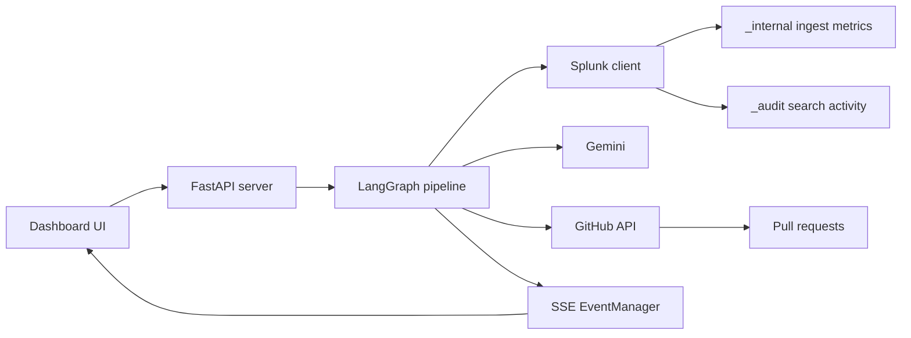

# Architecture

## System Overview



## Runtime Flow

1. The UI calls `POST /trigger`.
2. The server creates a `run_id` and a queue in `EventManager`.
3. The LangGraph pipeline runs in the background.
4. Each node emits structured events to the queue.
5. The browser subscribes to `GET /events/{run_id}` with `EventSource`.
6. The final report event includes savings and PR links.

## LangGraph Nodes

| Order | Node | Responsibility |
|---|---|---|
| 1 | `ingest_analysis` | Query `_internal` for ingest volume by sourcetype |
| 2 | `search_audit` | Query `_audit` for searched sourcetypes |
| 3 | `waste_detection` | Cross-reference ingest vs search usage |
| 4 | `source_tracing` | Map wasteful sourcetypes to repo/config files |
| 5 | `code_analysis` | Read configs and generate log-level changes |
| 6 | `pr_creation` | Create branch, commit, and pull request |
| 7 | `report` | Summarize findings, actions, savings, and links |

If no waste is found after node 3, the graph skips directly to `report`.

## Core SPL

Ingest volume:

```spl
index=_internal source=*metrics.log group=per_sourcetype_thruput
| stats sum(kb) as total_kb by series
| eval daily_gb = round(total_kb / 1024 / 1024 / 30, 2)
| sort - daily_gb
| head 50
| eventstats sum(daily_gb) as grand_total
| eval pct_of_total = round(daily_gb / grand_total * 100, 1)
| table series, daily_gb, pct_of_total
| rename series as sourcetype
```

Search activity:

```spl
index=_audit action=search info=completed
| rex field=search "sourcetype\s*=\s*\"?(?<searched_sourcetype>[^\s\"|]+)"
| stats count as search_count by searched_sourcetype
| sort - search_count
```

## Waste Logic

A source is wasteful when:

- it is expensive relative to ingest volume and has fewer than the configured search threshold, or
- it is a known app sourcetype with zero search usage in the demo dataset.

Synthetic sourcetypes use deterministic production-scale baselines so the demo can represent enterprise impact while staying small enough to load locally.

## State Shape

The graph state is defined in `src/agent/state.py`. Important fields:

- `ingest_by_source`
- `search_activity`
- `wasteful_sources`
- `source_repos`
- `proposed_changes`
- `pull_requests`
- `report`
- `events`
- `errors`
- `current_step`

## External Services

| Service | Role |
|---|---|
| Splunk | Evidence source for ingest and search usage |
| Gemini | Reasoning for source tracing and config changes |
| GitHub | Remediation target through PR creation |

## UI Event Schema

```json
{
  "step": "waste_found",
  "title": "Waste Detected",
  "detail": "Found 3 wasteful sourcetypes.",
  "status": "complete",
  "data": {},
  "timestamp": "2026-06-07T12:00:00Z"
}
```

Statuses: `running`, `complete`, `info`, `error`.
